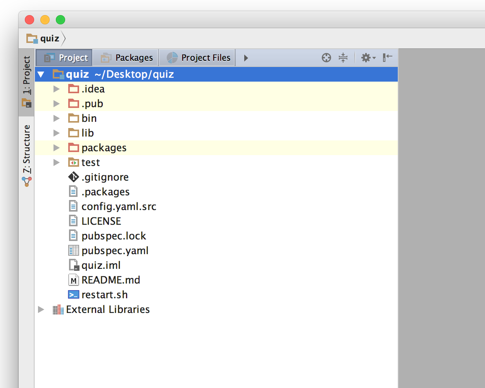
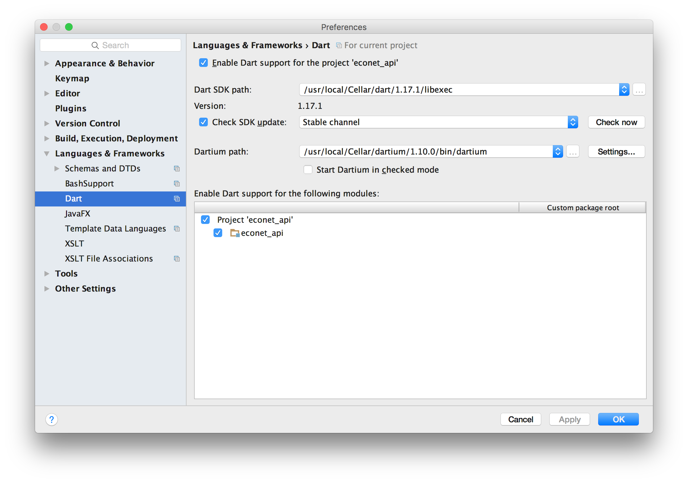

* This guide is written for developers on Mac OS X.


The boring part: Installation
---

You'll need to install a few things and they are all painless: Dart, IntelliJ IDEA Community Edition, PostgreSQL and a Dart package called `wildfire`.

First, start downloading IntelliJ IDEA CE because it'll take the longest to download: [https://www.jetbrains.com/idea/download/](https://www.jetbrains.com/idea/download/). The Community Edition is free (and still has all of the Dart features), but if you already have the Ultimate Edition or something like WebStorm, you're done with this step.

Next, install Dart. If you have Homebrew installed, run these from terminal:

```bash
brew tap dart-lang/dart
brew install dart
```

If you don't have Homebrew installed or you are on another platform, visit [https://www.dartlang.org/downloads](https://www.dartlang.org/downloads). It'll be quick, promise.

Next, you'll want PostgreSQL. A fundamental premise of `aqueduct` is testability, and having a local PostgreSQL instance is essential for that. Good news: just download the Postgres app from [http://postgresapp.com](http://postgresapp.com). Once you've downloaded it, just run it - there's now a self-contained local instance of PostgreSQL running on your machine. You can quit the app to stop it. If you're like me, you develop a lot - so I've added Postgres.app to my Startup Items.

IntelliJ IDEA is probably done downloading by now, so you'll want to install the Dart plugin. Open up Preferences in IntelliJ, and navigate to the Plugins section. Click on 'Install JetBrains plugin...' and search for Dart. Click Install.


Finally, you'll install a Dart package called `wildfire`. This package is just a tool to generate a template project that makes this whole thing easy. From the command line,

```bash
pub global activate --source git https://github.com/stablekernel/wildfire.git
```

That's it for now. We'll tweak some of this stuff soon, but that's all of the installation stuff.

Now, you'll create a new project. From the command line, navigate to the directory you want the project in and use `wildfire` to generate it. We'll call this new project `quiz` (Have you noticed that Dart application and library names are all lowercase? They also should use underscores instead of spaces, because some filesystems aren't cool with case sensitivity or spaces.)

```bash
pub global run wildfire:ignite quiz
```

After a few moments, you'll have a new directory named quiz. In IntelliJ, choose 'Open' from the welcome panel and select the quiz directory.


Once the project window opens, expand the project navigator on the left by selecting the Project side tab.



If IntelliJ doesn't recognize that this is a Dart project, it'll start popping up little warning boxes. If that is the case, open your Preferences, select Dart from Languages and Frameworks. Set the Dark SDK Path to installed Dart SDK (if you are using Homebrew, the SDK is the directory /usr/local/Cellar/dart/1.17.1/libexec/).



There's some directories in the project navigator. The ones you care about are bin, lib and test. Bin is where executables are that you run from the command line to do things, lib is where the code for your project is, and test is where your tests that make sure your project actually work live. There's some other files, too, and we'll get to all of them eventually, but for now there is one you care about: pubspec.yaml. Open that file.

These are the dependencies for your project. Click on the 'Get Dependencies' button on the top right area of the editor area, and IntelliJ will fetch them for you. Dependencies get stored in the directory ~/.pub-cache. You won't have to worry about that, though, since you'll never have to deal with it directly. Sometimes, it's just nice to know where things are.

Building a Quiz
---

We're going to build a totally useful Quiz web server. There will be an endpoint to get a list of questions, and an endpoint to get a list of answers. There will also be an endpoint to get a specific question and a specific answer.

Let's write some code. Create a new file by control-clicking on lib/src/controller and selecting New -> Dart File. Name this file `question_controller` (the .dart suffix gets added automatically). Then, we have to add this file to the `quiz` library file, which is something the IDE should really do for us, but it doesn't. Locate src/quiz.dart and add the following line to the bottom of it:

```dart
part 'src/controller/question_controller.dart';
```

Great, now back in `question_controller.dart` we'll create a new subclass of `HttpController`.

```dart
part of quiz;

class QuestionController extends HttpController {

}
```

An `HttpController` is a `RequestHandler`. The fundamental purpose of a `RequestHandler` is to handle a request. There a lots of different types of `RequestHandler`s, like routers, authenticators and different flavors of `HttpController`s. Sometimes a `RequestHandler` will respond to a request, and sometimes it will pass it on to another `RequestHandler` after OK'ing it. For example, an authenticator will respond with a 401 if the request has the wrong credential information, but otherwise it lets the request pass on to the next handler.

`HttpController`s are the final stop for a request, and so they should also respond to a request when they receive one. We want this particular `QuestionsController` handler to return a JSON list of question strings when it gets a GET request. Fill out the body of this class as so:

```dart
part of quiz;

class QuestionController extends HttpController {
	var questions = [
		"How much wood can a woodchuck chuck?",
		"What's the tallest mountain in the world?"
	];

	@httpGet getAllQuestions() async {
		return new Response.ok(questions);
	}
}
```

Methods in an `HttpController` that are annotated with @httpGet, @httpPost, etc. are called *handler methods*. When a GET request makes its way to this controller, this method will be executed. All handler methods must return an instance of `Response`. A `Response` has a bunch of built-in convenience constructors for typical HTTP status codes. This specific one, `Response.ok`, will return a 200 and the argument (a list of strings) will be serialized into JSON in the HTTP response body. (There's plenty of stuff to return all kinds of status codes, headers, content types, and handle weird HTTP methods, but we'll save those for later.)

In order for the `QuestionsController` to get a request, we need to set up a route to it. Open the file lib/src/pipeline.dart and locate the class `QuizPipeline`.

All `aqueduct` applications have a pipeline, which is a subclass of `ApplicationPipeline`.  A pipeline is also a `RequestHandler`. In fact, it is always the first request handler - the entry point into your application's code. The job of the pipeline is to set up what's in store for a request by setting up a series of `RequestHandler`s.

A pipeline doesn't hang on to a request for long, it simply forwards it to its `router` - an instance of `Router`, which as you may have guessed is another `RequestHandler` subclass. The router's job is to look at the path of the request and send it on to the next handler in the pipeline. We'd like this router to send requests with the `/questions` path to an instance of `QuestionsController`. In the method `addRoutes`, add the following code to the top of the method (ignoring the boilerpate):

```dart
@override
void addRoutes() {
	router
		.route("/questions")
		.next(() => new QuestionController());
...

```

We can run this now. There is a build configuration named 'Run' in the top-right menu, select that and click the green play button next to it. (You can also just run `dart bin/start.dart` from the project's directory.) Open up your browser and enter `http://localhost:8000/questions`. You'll see a JSON array of questions. Neat.

Magic is for children
---

Let's trace how that all went down. Open `bin/start.dart`, this is the executable script you ran to start the server. You probably won't need to modify this file for most applications. This executable will read in a configuration file, start a logging service and then start the application. If it fails during startup, you'll get an error message written to a file named `error.log`.

We'll look into the configuration and logging stuff later, but the interesting bit here is the `Application` and its start method. An application is a container for instances of a specific pipeline, and that pipeline is determined by its type argument:

```dart
var app = new Application<QuizPipeline>();
app.configuration.port = config.port;
app.configuration.pipelineOptions = {
  QuizPipeline.LoggingTargetKey : logger.getNewTarget(),
  QuizPipeline.ConfigurationKey : config
};

await app.start(numberOfInstances: 3);
```

When the application is started, it spins up multiple `Isolates` (three in this case). Each isolate is effectively a separate thread, and each starts listening for HTTP requests (don't worry, they share nicely). For each isolate, an instance of the pipeline type is created and its setup methods - like `addRoutes` are called. When the application receives a request, one of the isolates grabs it, sends it to its pipeline and so the party begins.

The pipeline delivers the request to its router which is then delivered to a fresh instance of `QuestionController`. The `QuestionController` checks the HTTP method of the request, and finds the matching handler method. That method returns a `Response`, which then completes the request and returns the information back to the client.

So, an application is a generic container for an application-specific pipeline. Within the pipeline, you set up series' of `RequestHandler`s to process a request. It's really that simple.

RequestHandlers
---

`RequestHandler`s are pretty simple. They receive a request and may or may not respond to it. If they don't respond, they send it to the next `RequestHandler`.


An `Authenticator`, for example, will check the credentials of a request to see if they are valid. If not, it will respond to the request with a 401 status code and prevent that request from moving on to the next handler.

With the exception of routers, `RequestHandler`s are chained through their `next` method. This method takes the next `RequestHandler` as an argument and returns that same `RequestHandler` as a result. This allows for chaining together of `RequestHandlers`:

```dart
handlerA
	.next(handlerB)
	.next(handlerC)
	.next(handlerD);
```

It oftentimes makes sense to create a new instance of a `RequestHandler` for each request - that way the `RequestHandler` can maintain some state while it is in the process of handling a request. Once the request is finished, the handler will get discarded, and a new one will get created the next time it is needed. Therefore, you may also pass a closure that returns an instance of a `RequestHandler` as a `next`.

```dart
handlerA
	.next(handlerB)
	.next(() => new HandlerC());
```

For `HttpController`s, it is required that you always create a new instance for every request. That's because the controller keeps a bit of state about the request that you can access in your handler methods. If we reused the same controller for each request, really bad things would happen - especially because more than one request can be processed at once!

Don't worry though, `HttpController`s are marked with `@cannotBeReused` metadata, so if you forget to wrap it in a closure, your application will throw an error immediately and tell you to wrap it in a closure.

Routers are slightly different. Instead of having just one `next`, they contain a collection of "next" s, set through the `route` method. `route` generates an instance of a `RouteHandler` that is added to the router. Because `RouteHandler` is a subclass of `RequestHandler`, you can chain handlers off it.
If a router gets a request for which it has a matching route, it sends it to that `RouteHandler`, which then immediately forwards it to its `next`. If a router can't find a route that matches the incoming request, it responds to the request with a 404.


Routing and Another Route
---

So far, we've added a route that matches the constant string `/questions`. Routers can do more than match a constant string, they can also include path variables, optional path components, regular expression matching and the wildcard character. We'll add to the existing /questions route by allowing requests to get a specific question.

In `pipeline.dart`, modify the code in `addRoutes` by adding "/[:id]" to the route.

```dart
  @override
  void addRoutes() {
	router
		.route("/questions/[:index]")
		.next(() => new QuestionController());
	...
```

The square brackets indicate that part of the path is optional, and the colon indicates that it is a path variable. A path variable matches anything. Therefore, this route will match if the path is `/questions` or `/questions/2` or `/questions/foo`.

When using path variables, you may optionally restrict which values they match with a regular expression. The regular expression syntax goes into parantheses after the path variable name. Let's restrict the `id` path variable to only numbers:

```dart
  @override
  void addRoutes() {
	router
		.route("/questions/[:id(\\d+)]")
		.next(() => new QuestionController());
	...
```

Now, there are two types of requests that will get forwarded to a `QuestionController` - a request for all questions (`/questions`) and and a request for a specific question at some index (`/questions/1`). We need to add a new handler method to `QuestionController`, so add the following to `question_controller.dart`.

```dart
class QuestionController extends HttpController {
  var questions = [
    "How much wood can a woodchuck chuck?",
    "What's the tallest mountain in the world?"
  ];

  @httpGet getAllQuestions() async {
    return new Response.ok(questions);
  }

  @httpGet getQuestionAtIndex(int index) async {
	if (index < 0 || index >= questions.length) {
      return new Response.notFound();
    }

    return new Response.ok(questions[index]);  
  }
}
```

Run the application again. In your browser, enter http://localhost:8000/questions and you'll get the list of questions. Then, enter http://localhost:8000/questions/0 and you'll get the first question. If you enter an index not within the list of questions or something other than an integer, you'll get a 404.

Now, there isn't any magic here. When a route has a path variable and a request comes in that matches that path variable, the router will add a map containing the path variable name (in this case, `index`) and the value for that path variable for the specific request. As you know, an `HttpController` already looks at the HTTP method of an incoming request to determine which handler method to use. When the request has a path variable map added to it by the router, the `HttpController` also looks at the arguments to each of your handler methods.

It then looks at the name of the argument - `getQuestionAtIndex` has an argument named `index` - and if that argument name matches the name of the path variable in `route`, it selects that method to handle the request.

Challenge
---
Create the controller and route for `/answers` and `/answers/:index`.


The More You Know: Multi-threading and Application State
---
In this simple exercise, we used a constant list of question as the source of data for the questions endpoint. For a simple getting-your-feet-wet demo, this is fine.

However, in a real application, it is important that we don't keep any mutable state in a pipeline or any request handlers. This is for three reasons. First, it's just bad practice - web servers should be stateless. They are facilitators between a client and a repository of data, not a repository of data themselves. A repository of data is typically a database.

Second, the way `aqueduct` applications are structured makes it really difficult to keep state. For example, `HttpController` is instantiated each time a new request comes in. Any state they have is discarded after the request is finished processing. This is intentional.

Finally, `aqueduct` is set up to run on multiple threads (the `numberOfInstances` argument for the `Application`'s `start` method), which Dart calls `Isolate`s. An isolate is a effectively thread that shares no memory with other isolates. If we were to keep track of state in some way, that state would not be reflected across all of the isolates running on this web server. So depending on which isolate grabbed a request, it may have different state than you might expect. Of course, this is also the case if you have multiple servers running the same `aqueduct` application as well, so `aqueduct` forces you into this model.

Isolates will spread themselves out across CPUs on the host machine. Having multiple isolates running the same stateless web server on one machine allows for faster request handling. Each isolate also maintains its own set of resources, like database connections.
