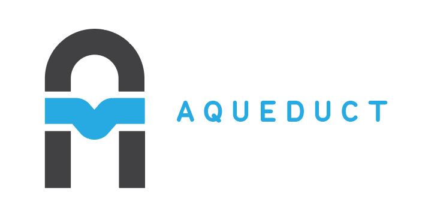

Aqueduct is a productive server-side framework for building REST APIs.

### Tutorial

If this is your first look at Aqueduct, check out the Tutorials below. They are a step-by-step guide to creating an Aqueduct application from scratch and take about 1-2 hours to complete.

  [Chapter 1: Routing and Request Handling](tut/getting-started.html)

  [Chapter 2: Writing Tests](tut/writing-tests.html)

  [Chapter 3: Executing Database Queries](tut/executing-queries.html)

  [Chapter 4: Relationships and Joins](tut/model-relationships-and-joins.html)

  [Chapter 5: Deployment](tut/deploying-and-other-fun-things.html)

### Documentation

Deeper dives into the framework are available under the Guides in the sidebar.

[Aqueduct API Reference](https://www.dartdocs.org/documentation/aqueduct/latest).

[Aqueduct on Github](https://github.com/stablekernel/aqueduct).

### Creating an Application

Once you are familiar with the fundamentals of the framework, you can get started fast on a new project with the following steps:

1. [Install Dart](https://www.dartlang.org/install).
2. Activate Aqueduct

        pub global activate aqueduct

3. Run first time setup.

        aqueduct setup

4. Create a new project.

        aqueduct create -n my_project
