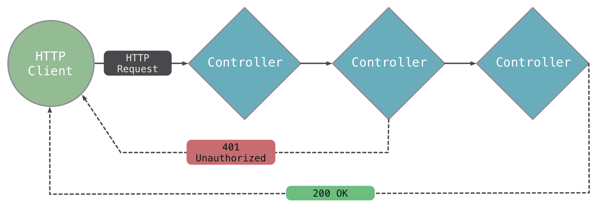

# Handling Requests: Fundamentals

Learn how `Controller` objects are linked together to handle HTTP requests.

## Overview

A controller is the basic building block of an Aqueduct application. A controller does something with an HTTP request. For example, a controller could return a 200 OK response with a JSON-encoded list of city names. A controller could also check a request to make sure it had the right username and password.

These controllers can be linked together to get more complex behavior: if the request has the right username and password, the response with city names is sent. Aqueduct applications are many linked together controllers that form an application's behavior. Some of these controllers are created specifically for an application, and some can be reused across multiple applications.

This ordered organization of controllers is called an *application channel*, and is created when the application starts. One controller is designated as the first controller in the channel. It is the channel's *entry point* and it the first to receive a new request. It can either send a response, or send it to its linked controller. The linked controller can do the same, and so on.



Some controllers can choose from multiple controllers, depending on something about the request. In most applications, the entry point is a `Router` controller that chooses the next controller based on the path of the request.


## Linking Controllers

Controllers are linked together by overriding the `entryPoint` getter of an `ApplicationChannel` subclass. Here's an example:

```dart
@override
Controller get entryPoint {
  final router = new Router();

  router
    .route("/path")    
    .link(() => new Authorizer())
    .link(() => new NoteController());

  return router;
}
```

The `Router` controller returned from this getter is the entry point of the channel. It handles every request; if that request is '/path', a new `Authorizer` is created to handle the request next. The `Authorizer` makes sure the request is authorized before it reaches a `NoteController`. The `NoteController` fulfills the request - probably by sending a response with a list of notes or by adding a note from the request body to the database.

Linking controllers and creating an `ApplicationChannel` is covered more in depth in [this guide](channel.md).

## Creating Request Handling Behavior by Subclassing Controller

Controllers like `Router` and `Authorizer` are part of Aqueduct can be used in any application. Controllers that are specific to your application are defined by subclassing `Controller`. A controller's behavior is defined by overriding its `handle` method:

```dart
class NoteController extends Controller {
  @override
  Future<RequestOrResponse> handle(Request request) async {
    final notes = await fetchNotesFromDatabase();

    return new Response.ok(notes);
  }
}
```

This `handle` method always creates and returns a `Response` object. The response returned from a controller is sent to the client. A controller that always returns a response is called an *endpoint controller*. When linking a series of controllers, an endpoint controller is always the last link.

Controllers that handle the request before it reaches an endpoint controller are called *middleware controllers*. A typical middleware controller is `Authorizer` - it lets a request pass through if it has valid credentials in its Authorization header. An `Authorizer` sends an error response if the credentials aren't valid, preventing the endpoint from being reached. The pseudo-code for an `Authorizer` looks like this:

```dart
class Authorizer extends Controller {
  @override
  Future<RequestOrResponse> handle(Request request) async {
    if (isValid(request)) {
      return request;
    }

    return new Response.unauthorized();
  }
}
```

Controllers let a request pass to their linked controller by returning the request from `handle`. (Whereas returning a `Response` sends the response, and the linked controller never sees the request.)

!!! tip "Endpoint Controllers"
    In most cases, endpoint controllers are created by subclassing [ResourceController](resource_controller.md). This controller allows you to declare more than one handler method in a controller to better organize logic. For example, one method might handle POST requests, while another handles GET requests.

## Linking Functions

For simple behavior, functions with the same signature as `handle` can be linked to controllers:

```dart
  router
    .route("/path")
    .linkFunction((req) async => req);
    .linkFunction((req) async => new Response.ok(null));
```

Linking a function has all of the same behavior: it can return a request or response, automatically handles exceptions, and can have controllers (and functions) linked to it.

## Exception Handling

If an exception or error is thrown during the handling of a request, the controller currently handling the request will catch it. For the majority of values caught, a controller will send a 500 Server Response. The details of the exception or error will be [logged](configure.md), and the request is completed (it will not be passed to a linked controller).

This is the default behavior for all thrown values except two: `Response` and `HandlerException`.

### Throwing Responses

A `Response` can be thrown at any time; the controller handling the request will catch it and send it to the client. This completes the request. This might not seem useful, for example, the following shows a silly use of this behavior:

```dart
class Thrower extends Controller {
  @override
  Future<RequestOrResponse> handle(Request request) async {
    if (!isForbidden(request)) {
      throw new Response.forbidden();
    }

    return new Response.ok(null);
  }
}
```

However, it can be valuable to send error responses from elsewhere in code as an application's codebase becomes more layered.

### Throwing HandlerExceptions

Exceptions can implement `HandlerException` to provide a response other than the default when thrown. For example, an application that handles bank  transactions might declare an exception for invalid withdrawals:

```dart
enum WithdrawalProblem {
  insufficientFunds,
  bankClosed
}
class WithdrawalException implements Exception {
  AccountException(this.problem);

  final WithdrawalProblem problem;
}
```

Controller code might catch this exception to return a different status code depending on the exact problem with a withdrawal. If this code has to be written in multiple places, it is useful for `WithdrawalException` to implement `HandlerException`. An implementor must provide an implementation for `response`:

```dart
class WithdrawalException implements Exception {
  AccountException(this.problem);

  final WithdrawalProblem problem;

  @override
  Response get response {
    switch (problem) {
      case WithdrawalProblem.insufficientFunds:
        return new Response.badRequest(body: {"error": "insufficient_funds"});
      case WithdrawalProblem.bankClosed:
        return new Response.badRequest(body: {"error": "bank_closed"});
    }
  }
}
```

The Aqueduct ORM exceptions (`QueryException`) implement `HandlerException` to return a response that best represents the ORM exception. For example, if a unique constraint is violated by a query, the thrown exception implements `response` to return a 409 Conflict response.

## Modifying a Response with Middleware

A middleware controller can adding *response modifier* to a request. When an endpoint controller eventually creates a response, these modifiers are applied to it before it is sent. Modifiers are added by invoking `addResponseModifier` on a request.

```dart
class Versioner extends Controller {
  Future<RequestOrResponse> handle(Request request) async {
    request.addResponseModifier((response) {
      response.headers["x-api-version"] = "2.1";
    });

    return request;
  }
}
```

When a request passes through this controller, the response will have the header `x-api-version: 2.1`.

Any number of controllers can add a response modifier to a request; they will be processed in the order that they were added. Response modifiers are applied before the response body is encoded, allowing the body object to be manipulated.

## CORS Headers and Preflight Requests

`Controller`s have built-in behavior for handling CORS requests. They will automatically respond to `OPTIONS` preflight requests and attach CORS headers to any other response. See [the chapter on CORS](configure.md) for more details.
