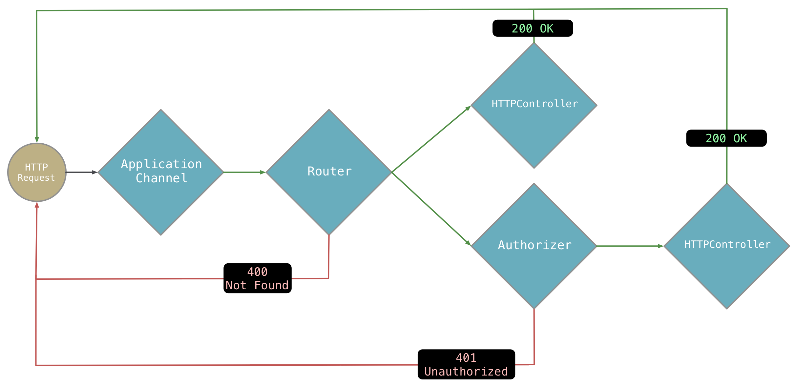

# Handling Requests: Fundamentals

This guide provides a deeper understanding of how a request object moves through an Aqueduct application to get responded to. For more use-case based guidance on handling requests, see [HTTPController](http_controller.md).

An Aqueduct application is a [channel of RequestController](structure.md) instances that HTTP requests go through to get responded to.



The above diagram shows a request entering a channel at a `RequestSink` and then being passed to a `Router`. The `Router` splits the channel. If a request's path matches a registered route, the request is passed down the split channel. If it doesn't, the `Router` stops the request from continuing down the channel and responds to it with a 404 Not Found response. Likewise, `Authorizer` might reject a request if it doesn't have valid authorization credentials or let it pass to the next controller in the channel. At the end of the channel, some controller must respond to the request.

Channels always begin with a `RequestSink` and a `Router`. This channel is built upon by invoking `route` on the `Router`, which splits the channel into subchannels. These subchannels are added to with the methods `pipe`, `generate`, and `listen`. Each of these `RequestController` methods attaches another `RequestController` to form a channel. Here's an example:

```dart
@override
void setupRouter(Router router) {
  router
    .route("/path")
    .listen((Request request) async {
      logger.info("$request");
      return request;
    })
    .pipe(new FilteringController())
    .generate(() => new CRUDController());
}
```

First, notice that these methods can be chained together in this way because they always return the controller being added to the channel. For example, `router.route` creates a new "route controller" and returns it. The route controller then has `listen` invoked on it, which creates a new `RequestController` from a closure and returns it, for which `pipe` is invoked... you get the drift.

The `listen` method is the easiest to understand: it takes an async closure that takes a `Request` and may either return a `Response` or that same `Request`. If it returns the `Request`, the request is passed to the next controller in the channel. If it returns a `Response`, a response is sent to the HTTP client and no more controllers get the request.

Concrete implementations of `RequestController` - like the mythical `FilteringController` and `CRUDController` above - override a method with the same signature as the `listen` closure. This method is named `processRequest` and it looks like this:

```dart
class FilteringController {
  @override
  Future<RequestOrResponse> processRequest(Request request) async {
    if (isThereSomethingWrongWith(request)) {
      return new Response.badRequest();
    }

    return request;
  }
}
```

(In fact, the `listen` closure is simply wrapped by an instance of `RequestController`. The default behavior of `processRequest` is to invoke its closure.)

The difference between `pipe` and `generate` is important. A `RequestController` like `FilteringController` doesn't have any properties that change when processing a request. But let's pretend `CRUDController` is defined like the following, where it reads the body into a property and then accesses that property later:

```dart
class CRUDController {
  Map<String, dynamic> body;

  @override
  Future<RequestOrResponse> processRequest(Request request) async {
    body = await request.body.asMap();

    if (request.innerRequest.method == "POST") {
      return handlePost();
    } else if (request.innerMethod == "PUT") {
      return handlePut();
    } ...
  }

  Future<RequestOrResponse> handlePost() async {
    ... do something with body ...
  }
}
```

In the above, the `body` property will be updated when `CRUDController` receives a request. It is possible that `CRUDController` is working on creating a response when it gets a new request, changing its `body` property. This would change the `body` for all requests that `CRUDController` is currently processing!

Therefore, when a controller has state that changes for every request, a new instance should be created for each request. The `generate` method takes a closure that creates a new instance of a controller. The `pipe` method on the other hand reuses the same controller for every request because the request passes right through it without changing any of its state.

The most common controller in an Aqueduct is an `HTTPController`. This controller handles all requests for an HTTP resource. For example, a controller of this type might handle `POST /users`, `PUT /users/1`, `GET /users`, `GET /users/1` and `DELETE /users/1`. It has conveniences for organizing code such that each of these operations is bound to its own instance method. These conveniences require that the controller store parsed values from the request in it properties. Therefore, all `HTTPController`s must be added to a channel with `generate`.

`HTTPController` - and any other controller that requires a new instance for each request - is marked with `@cannotBeReused` metadata. If you try and `pipe` to a controller with this metadata, you'll get an error at startup with a helpful error message.

## Exception Handling

`RequestController`s wrap `processRequest` in a try-catch block. If an exception is thrown during the processing of a request, it is caught and the controller will send a response on your behalf. The request is then removed from the channel and no more controllers will receive it.

There are two types of exceptions that a `RequestController` will interpret to return a meaningful status code: `HTTPResponseException` and `QueryException`. Any other uncaught exceptions will result in a 500 status code error.

`QueryException`s are generated by the Aqueduct ORM. A request controller interprets these types of exceptions to return a suitable status code. The following reasons for the exception generate the following status codes:

|Reason|Status Code|
|---|---|
|A programmer error (bad query syntax)|500|
|Unique constraint violated|409|
|Invalid input|400|
|Database can't be reached|503|

An `HTTPResponseException` can be thrown at anytime to escape early from processing and return a response. Exceptions of these type allow you to specify the status code and a message. The message is encoded in a JSON object for the key "error". Some classes in Aqueduct will throw an exception of this kind if some precondition isn't met.

If you have code that can throw for legitimate reasons, you may catch those exceptions to return a response with an appropriate status code:

```dart
class Controller extends RequestController {
  Future<RequestOrResponse> processRequest(Request request) async {
    try {
      await someFailableOperation();
    } on OperationException catch (e) {
      return new Response(503, null, {"error": e.errorMessage});
    }

    ...
  }
}
```

You may also catch `Query` or `HTTPResponseException`s to reinterpret them, but the default behavior is pretty reasonable.

Other than `HTTPResponseException`s, exceptions are written to the `Logger` along with some details of the request that generated the exception. `HTTPResponseException`s are not logged, as they are used for control flow and are considered "normal" operation.

## Subclassing RequestController

Using existing subclasses of `RequestController` like `Router`, `Authorizer` and `HTTPController` cover the majority of Aqueduct use cases. There are times where creating your own `RequestController` subclass may make sense.

To pass a request on to the next controller in the channel, a controller must return the same instance of `Request` it receives. It may, however, attach additional information by adding key-value pairs to the request's `attachments`.

For example, an `Authorizer`'s pseudo code looks like this:

```dart
Future<RequestOrResponse> processRequest(Request request) async {
    if (!isAuthorized(request)) {
      return new Response.unauthorized();
    }

    request.attachments["authInfo"] = authInfoFromRequest(request);
    return request;
}
```

The next controller in the channel can look up the value of `authInfo`:

```dart
Future<RequestOrResponse> processRequest(Request request) async {
    var authInfo = request.attachments["authInfo"];


    return new Response.ok("You are user: ${authInfo.username}");
}
```

## Middleware Modifying a Response

A `RequestController` that doesn't respond to a request can still modify the eventual response. This is valuable for "middleware" `RequestController` that have some information to return back to the client, but aren't responsible for generating the response. For example, the following shows a request channel where `UserController` will create the response, but middleware will add a header to the response:

```dart
router
  .route("/path")
  .listen((req) async {
    return req
      ..addResponseModifier((response) {
        response.headers["x-api-version"] = "2.1";
      });
  })
  .generate(() => new UserController());
```

Modifiers are run in the order they are added to a request and are run before any body data is encoded or any values are written to the network socket.

## CORS Headers and Preflight Requests

`RequestController`s have built-in behavior for handling CORS requests. They will automatically respond to `OPTIONS` preflight requests and attach CORS headers to any other response. See [the chapter on CORS](configure.md) for more details.
