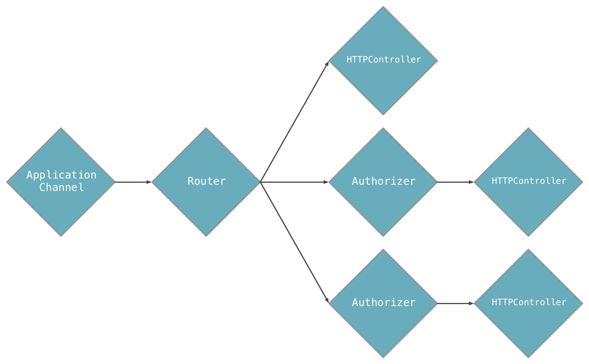

# Aqueduct Application Architecture

The fundamental object of Aqueduct is a `RequestController`. Request controllers are chained together to create a *request channel*. A request channel is a series of request controllers that a request flows through to be verified, modified and responded to.



A request channel always starts at an instance of `RequestSink`. When an application receives an HTTP request, it adds it to the `RequestSink`. A `RequestSink` has a `Router` that splits the channel based on the path of the request. For example, a request with the path `/users` will go down one part of the channel, while a `/things` request will go down another.

An application's request channel is defined in its `RequestSink`. Each application will have one and only one `RequestSink` subclass that must implement `setupRouter`. For example, the diagram above looks like this in code:

```dart
class MyRequestSink extends RequestSink {
  MyRequestSink(ApplicationConfiguration config) : super(config);

  @override
  void setupRouter(Router router) {
    router
      .route("/a")
      .generate(() => new AController());

    router
      .route("/b")
      .pipe(new Authorizer(...))
      .generate(() => new BController());

    router
      .route("/c")
      .pipe(new Authorizer(...))
      .generate(() => new CController());      
  }
}
```

Each controller in the channel can either respond to the request or send it to the next controller in the channel. For example, an `Authorizer` will respond with a 401 Unauthorized response if a request's authorization isn't valid - but if it is valid, the request is passed to the next controller in the channel.

This structure means that `RequestController` is the base class for types that are middleware and for those that always respond to a request. There are no other types that handle requests and this makes Aqueduct very simple to understand.

For more details, see [Request Controllers](request_controller.md).

## Isolates

An Aqueduct application may run its request channel on multiple isolates. The number of isolates is configured when running `aqueduct serve`.

```
aqueduct serve --isolates 3
```

An isolate is a thread with its own memory heap, thus each isolate has its own isolated replica of the request channel. Database connections and other resources created in a `RequestSink` are also replicated in each isolate.

When the application receives an HTTP request, only one of its isolates receives and responds to the request. This structure spreads computation across multiple CPUs/cores and makes patterns like connection pooling implicit, i.e. each isolate has its own database connection.

## Aqueduct Project Structure and Organization

An Aqueduct project is a directory that contains, at minimum, the following file structure:

```
pubspec.yaml
lib/
  application_name.dart
```

The name of any Dart application is defined by the `name` key in `pubspec.yaml`. In order for `aqueduct serve` to run your application, there must be a `.dart` file in `lib/` with that same name. This is your application library file and it must declare a `RequestSink` subclass or import another file that does. This is the bare minimum requirement to run an Aqueduct application. (See [Deploying](../deploy/overview.md) for more details on running applications.)

For organizing applications of reasonable size, we recommend the following structure:

```
pubspec.yaml
config.src.yaml
config.yaml
lib/
  application_name.dart
  application_name_sink.dart  
  controller/
    user_controller.dart
  model/
    user.dart
test/
  user_controller_test.dart
  harness/
    app.dart
```

The required `pubspec.yaml` and `lib/application_name.dart` files are present alongside a few others:

- `config.yaml`: A [configuration file](configure.md) for the running application.
- `config.src.yaml`: A [template for config.yaml](configure.md).
- `application_name_sink.dart`: A file solely for the `RequestSink` of an application. This file should be *exported* from `application_name.dart`.
- `controller/`: A directory for `RequestController` subclass files.
- `model/`: A directory for `ManagedObject<T>` subclass files.
- `test/harness/app.dart`: A [test harness](../testing/tests.md)) for automated testing.

Feel free to create other subdirectories in `lib/` for organizing other types of files.

## Aqueduct and dart:io

Aqueduct runs on top of `dart:io` and relies on its `HttpServer` implementation. When an Aqueduct application is started, one or more `HttpServer` instances are bound to the port specified by `aqueduct serve`. For each HTTP request, an instance of `Request` is created to wrap the `HttpRequest` from `dart:io`. The `Request` is added to a `RequestSink`, sending it through the channel of `RequestController`s until it is responded to.

In rare circumstances, you may choose to remove a `Request` from the request channel and manipulate the request with `dart:io` only. Once removed, it is your responsibility to respond to the request by setting properties on and closing the `HttpRequest.response`. To take a request out of the channel, simply return `null` from a `RequestController`:

```dart
@override
void setupRouter(Router router) {
  router
    .route("/bypass_aqueduct")
    .listen((req) async {
      req.response.statusCode = 200;
      req.response.close();

      return null;
    });
}
```

(In Aqueduct 2.2.1 and below, a `RequestController` that removes a request from the channel in this way must be the last request controller in the channel.)

This technique is valuable when Aqueduct can't do something you want it to do or when using [websockets](websockets.md).
