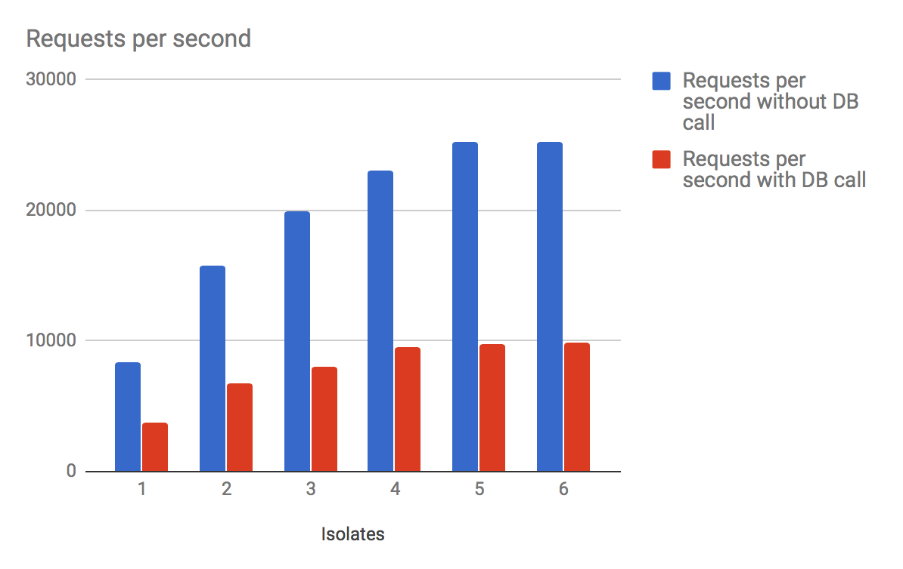
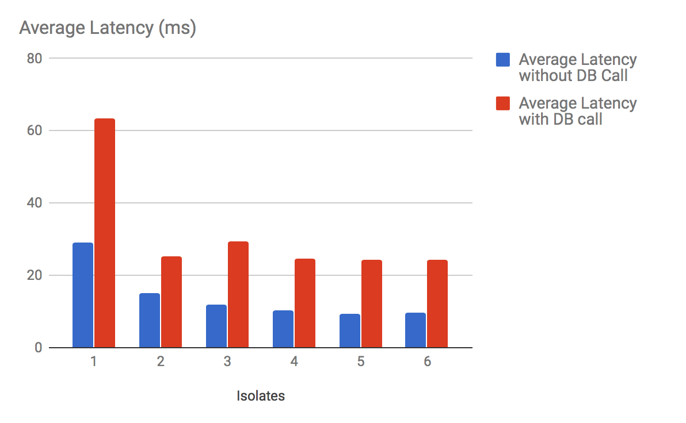

# Multi-threading in Aqueduct

One of the primary differentiators between Aqueduct and other server frameworks is its multi-threaded behavior. When an Aqueduct application starts, it replicates the application logic across a number of threads.

In Dart, threads are called *isolates*. The difference in naming isn't just to be cute - an isolate is a little bit different than a thread in that memory is not shared between isolates. Each isolate has its own heap (this is where memory for objects is allocated from) that other isolates can't access.

An isolated thread is very valuable. Many multi-threaded applications share memory across threads, which require difficult design patterns and can easily introduce hard to track bugs that even the most experienced programmer will have a hard time avoiding.

## How Aqueduct Uses Isolates

An application is initialized by invoking a series of initialization methods in a `RequestSink`. Once these methods are finished executing, the application starts sending HTTP requests through the request channel created by the `RequestSink`.

Because a `RequestSink` is a type - and can be instantiated - Aqueduct simply creates a number of isolates and instantiates `RequestSink` for each. The initialization code is therefore identical for each isolate, which means that the ongoing behavior of each isolate is also identical.

More importantly, you - the programmer - have to do absolutely nothing to take advantage of Aqueduct's multi-threaded behavior. You simply have to pick the number of isolates you want to run the application on (see [this section](#how-many-isolates-should-i-use)).

While you don't have to do anything in an Aqueduct application to take advantage of multiple processors, there are things you shouldn't do or should do in another way.

First, you must be careful of keeping any state in your application. Practically, this means that once your application has finished initializing, it shouldn't store a value in an object that lives past the lifetime of the request it was stored for. Any data that needs to be persisted must be stored in a database or other data store. This is just good practice for a REST API anyhow, so nothing is really lost here.

However, there are times where you do need to track state. For example, if you are managing websocket connections, you do need to store some state after initialization - a reference to the websocket. [This guide](websockets.md) covers this topic in detail; the simple explanation is to use the `ApplicationMessageHub`.

Another thing that is important to consider is initialization. Most initialization occurs in `RequestSink`'s constructor and its `setupRouter` method. This behavior is guaranteed to occur for each isolate and there is often little to worry about.

However, when implementing `RequestSink.initializeApplication`, code runs on the main isolate. Any changes to static variables or singletons will not be replicated to the isolates running the application logic. The use case for this method is rather minimal, but it is very important that types like `HTTPCodecRepository` aren't configured in this method.

## How Many Isolates Should I Use

To give you a starting point, the default number of isolates for an application is 3 when started with `aqueduct serve`. While less than 3 isolates will most certainly degrade performance, more than 3 doesn't necessarily improve performance. (And many more will certainly degrade performance.)

There are a number of variables that factor into the isolate count decision. First, recall a computer essentially does two things: it executes instructions and transmits data. Both of these tasks take time, especially when that data is transmitted to another computer thousands of miles away. (It is a modern marvel that these tasks occur as fast as they do - one that we often take for granted.)

While a few milliseconds difference in speed to handle a single request isn't all that meaningful, when you start receiving thousands of requests at a time, these milliseconds add up. When your application is struggling to keep up with executing instructions, it it said to be *CPU-bound*. (When your application is struggling to transmit data, it is said to be *IO-bound*.)

A CPU-bound application has two choices: execute less instructions or have more processors (or cores) to execute instructions with. Most computers these days have multiple processors. When only using a single isolate, an Aqueduct application can only use one of those processors at a time. As the number of isolates increases, so too do the number of processors that can be used at a time.

Thus, more isolates means more processors means more instructions and your application bound less by the CPU. However, there is a limit - creating 100 isolates when there are only two processors doesn't yield any greater performance, because 50 isolates will fight over a single processor. In fact, the amount of work to schedule these instructions and the amount of memory this many isolates will consume will hurt performance.

For example, when running benchmarks with [wrk](https://github.com/wg/wrk) on my four-core machine, I get significantly better results as I add isolates 1 through 4, but then I get marginal gains and finally less or equal performance as I increase the number of isolates past 4. The blue bar represents the number of requests per second for each isolate count when making a simple HTTP call to Aqueduct.

(Note that benchmarks are a good way of measuring relative performance of an application and identifying bottlenecks, but real world usability performance across a network is the only measurement that matters. The absolute value of these benchmarks should not be taken seriously, as they entirely remove the network portion of the transmission.)

But this isn't the whole story. Server applications are rarely CPU-bound, but instead IO-bound. The red bar represents the number of requests per second when making a database query and returning the results of that query as JSON in the response body. When using Observatory, the measurements indicate that the overwhelming majority of the time is spent transmitting data to and from the database. This is an example of being bound by IO (and the speed of the query).

Recall that each isolate has its own database connection. A database connection is a serial queue - it can only handle one query at a time. Increasing the number of database connections means handling more queries at a time. This is no more apparent than when looking at the following graph, which measures the latency of requests with and without a database call.

When there is only one database connection (one isolate), the latency is significantly higher per request - the application is entirely bound by the speed of the database serial queue. Adding a second isolate, and therefore a second database connection, drops the latency by more than half.

There are diminishing returns as more database connections are added. That's because the same thing about the number of threads per processor also applies to the number of database connections. Adding more database connections doesn't magically make the database server run any faster.

As a general rule, start with N-1 isolates, where N is the number of processors on the machine. Use `wrk` and Observatory to profile your application and tune accordingly. In a multi-instance environment, remember that the total number of database connections is MxN, where M is the number of machines and N is the number of isolates.

If you find yourself in a jam where IO would be better served less isolates, but CPU would be better served by more isolates, you may consider using a database connection pool isolate.
