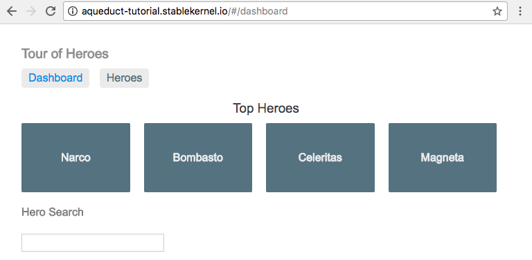
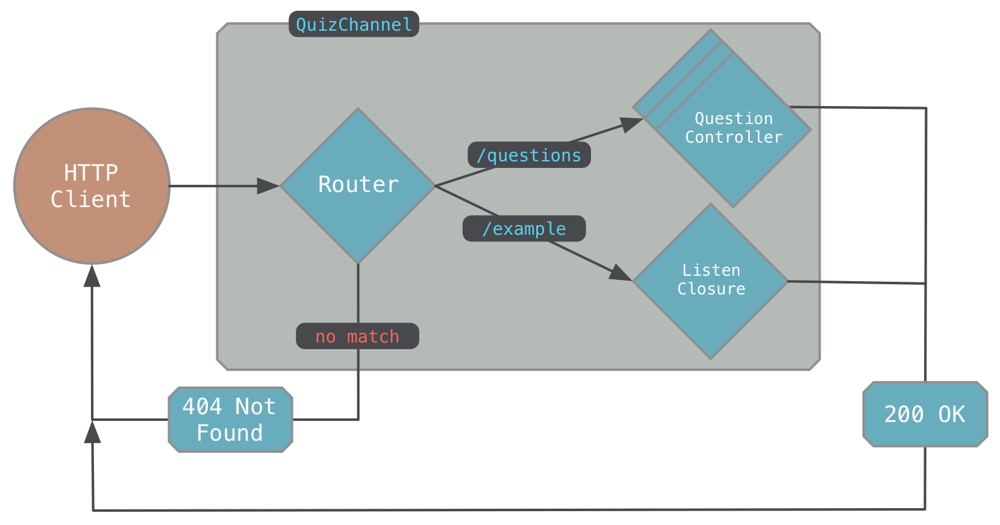
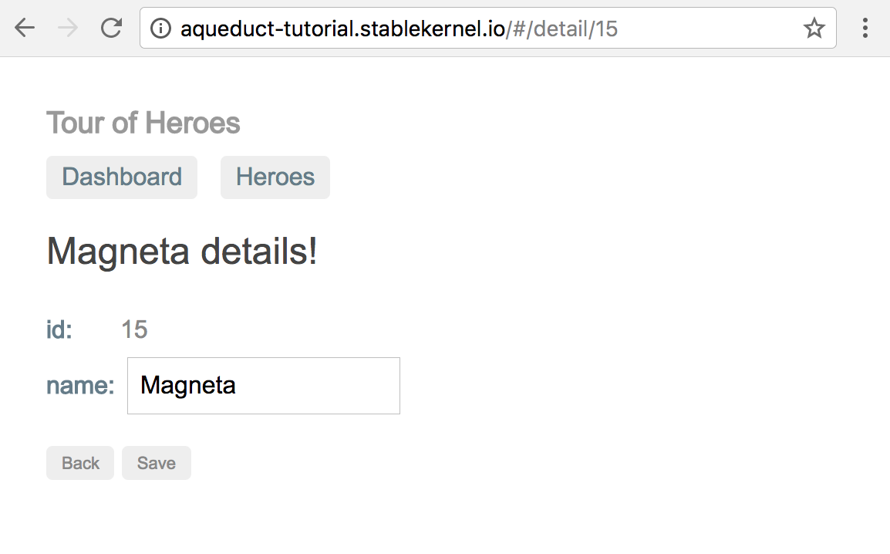

# 1. Getting Started

### Purpose: Become familiar with how Aqueduct works by building an application.

By the end of this tutorial, you will have created an Aqueduct application that serves fictional heroes from a PostgreSQL database. You will learn the following:

- Run an Aqueduct application
- Route HTTP requests to the appropriate handler
- Store and retrieve database data
- Write automated tests for each endpoint

## Installation

To get started, make sure you have the following software installed:

1. Dart ([Install Instructions](https://www.dartlang.org/install))
2. IntelliJ IDEA or any other Jetbrains IDE, including the free Community Edition ([Install Instructions](https://www.jetbrains.com/idea/download/))
3. The IntelliJ IDEA Dart Plugin ([Install Instructions](https://www.dartlang.org/tools/jetbrains-plugin))

If at anytime you get stuck, hop on over to the [Aqueduct Slack channel](http://slackaqueductsignup.herokuapp.com).

## Installing Aqueduct

`aqueduct` is a command-line utility for all things Aqueduct - including creating a new project. Install `aqueduct` with the following command:

```
pub global activate aqueduct
```

!!! warning ""
    If you get warning text about your `PATH`, make sure to read it before moving on.

Creating a Project
---

Create a new project named `heroes`:

```
aqueduct create heroes
```

This creates a `heroes` project directory.

Open this directory with IntelliJ IDEA by dragging the project folder onto IntellIJ IDEA's icon.

In IntelliJ's project view, locate the `lib` directory; this is where your project's code will go. This barebones project has two source files - `heroes.dart` and `channel.dart`.

Open the file `heroes.dart`. Click on the `Enable Dart Support` button in the top right corner of the editor.

## Handling HTTP Requests

In your browser, navigate to [http://aqueduct-tutorial.stablekernel.io](http://aqueduct-tutorial.stablekernel.io). This browser application will fetch heroes by making HTTP requests that your `heroes` application will respond to. At this end of this chapter, this browser application will be able to display a list of heroes and and the details of an individual hero. To do this, our `heroes` application needs to handle two requests:

1. `GET /heroes` to get a JSON list of heroes
2. `GET /heroes/:id` to get an individual hero

!!! warning "HTTP vs HTTPS"
    The browser application is served over HTTP so that it can access your Aqueduct application when it runs locally on your machine.

These requests are called *operations*. An operation is the combination of an HTTP method and a path. So, `GET /heroes` is an operation that "gets all heroes" and `GET /heroes/:id` is an operation that "gets a single hero by id". You should be able to describe all operations in plain English phrase.

Let's start by writing the code for the `GET /heroes` operation.

Create a new file in `lib/controller/heroes_controller.dart` and add the following code (you may need to create the subdirectory `lib/controller/`):

```dart
import 'package:aqueduct/aqueduct.dart';
import 'package:heroes/heroes.dart';

class HeroesController extends RESTController {
  final heroes = [
    {'id': 11, 'name': 'Mr. Nice'},
    {'id': 12, 'name': 'Narco'},
    {'id': 13, 'name': 'Bombasto'},
    {'id': 14, 'name': 'Celeritas'},
    {'id': 15, 'name': 'Magneta'},    
  ];

  @Bind.get()
  Future<Response> getAllHeroes() async {
    return new Response.ok(heroes);
  }
}
```

This code declares a new class named `HeroesController`. Its `getAllHeroes()` method is called an *operation method*. An operation method handles an operation by creating an HTTP response. For a method to be an operation method, it must meet the following criteria:

- It is an instance method declared in an `RESTController` subclass.
- It returns a `Future<Response>`.
- It has an annotation that indicates the HTTP method it handles, e.g. `@Bind.get()`, `@Bind.post()`.

Our `getAllHeroes()` method handles `GET` requests; this is determined by the `@Bind.get()` annotation. (If the annotation were, say, `@Bind.post()`, this method would handle `POST` requests.) It will return a 200 OK response with a JSON encoded list of heroes.

Therefore, we've declared that a `HeroesController` will respond to `GET` requests by calling `getAllHeroes()`, but we haven't written code that indicates this should happen when the path is `/heroes`. In other words, we've only defined half of our `GET /heroes` operation. To complete the operation, we have to learn a bit about the general structure of an Aqueduct application.

### Aqueduct Controllers

In Aqueduct, objects called *controllers* act on a request. For example, `HeroesController` acts by sending a 200 OK response if the request method is `GET`. Controllers can do more than just create a response; one might do something to verify the request is valid in some way, the other might add a header just before sending the response. Controllers are linked together to form a series of steps that a request goes through.

Each controller can do one of two things:

- Send a response for the request.
- Pass the request to the next controller in the series of steps.

Open `channel.dart` and take a look at `HeroesChannel.entryPoint`:

```dart
  @override
  Controller get entryPoint {
    final router = new Router();

    router
      .route("/example")
      .listen((request) async {
        return new Response.ok({"key": "value"});
      });

    return router;
  }
```

This code creates and links together three controllers. The first controller is a `Router` that we instantiate like we would any other object. This controller is returned from `entryPoint` and therefore it is the first controller to receive all HTTP requests in our application.

The `route` method creates a 'route controller' that filters requests and links it to the `Router`. If the `Router` receives a request with the path `/example`, it will pass it to this route controller. A route controller will always pass its request on to its next controller - in this case, the controller created by `listen`. A controller created by `listen` invokes its closure argument for any request. Therefore, we have the following order of controllers:

1. A `Router`
2. A route controller that takes requests with the path `/example`
3. A listen controller that invokes a closure that always responds with a 200 OK response.

Note that `route` and `listen` return the controller they create, allowing us to link controllers together. In other words, `route` and `listen` are instance methods of `Controller` and classes like `Router` are subclasses of `Controller`. The `route` method is invoked on the `Router`, creating a new route controller, and `listen` is invoked on that newly created route controller.

!!! note "Higher Ordered Functions"
    Methods like `listen` and `route` should be familiar to programmers that use methods like `map` and `where` on collection types like `List` and `Stream`.

For our `HeroesController` to receive requests, we need to create a route for the `/heroes` path and link a `HeroesController` to it. Import the file that contains our definition of `HeroesController` at the top of `channel.dart`:

```dart
import 'controller/heroes_controller.dart';
```

Then, modify `HeroesChannel.entryPoint`:

```dart
@override
Controller get entryPoint {
  final router = new Router();

  router
    .route("/heroes")
    .generate(() => new HeroesController());

  router
    .route("/example")
    .listen((request) async {
      return new Response.ok({"key": "value"});
    });

  return router;
}
```

Like `listen`, `generate` creates and links a controller. The difference between the two is that `listen` takes a closure that handles the request, whereas `generate` takes a closure that *creates a controller object to handle the request*. For quick and dirty request handlers, a `listen` controller is okay, but as your application grows, it is a lot easier to organize your request handling logic into controller objects like `HeroesController`.

With this route hooked up, a request with the path `/heroes` will get routed to a generating controller that creates a new instance of `HeroesController` to handle each request. We now have have fully-fledged operation for `GET /heroes` and we can run our application.

In the project directory, run the following command from the command-line:

```
aqueduct serve
```

Reload the browser page `http://aqueduct-tutorial.stablekernel.io`. You'll see your heroes in your web browser:

#### Screenshot of Heroes Application



## The Application Channel

As we mentioned, an Aqueduct application is made up of controllers that a request flows through. This group of controllers is called the *application channel*. Every application must subclass `ApplicationChannel` and override `entryPoint` to provide this channel of controllers.

If we were to draw our application in a a diagram, it would look like this:



Recall that the controller returned from this method is the first controller to receive a request; this was our `Router`. Also recall that controllers are added to the channel by invoking methods like `route`, `generate` and `listen`. Each has slightly different behavior:

- `route` is only available for routers - it branches the channel. If the request's path matches the route, it flows to the next step in the branch. If there is no match, it returns a 404 Not Found.
- `listen` adds a simple closure controller to the channel.
- `generate` creates a new instance of a controller for each request.

!!! tip "Why a new instance?"
    `RESTController`s have a lot of internal steps, so they need to temporarily store information about the request during those steps. This information gets stored in properties of the controller. Some of these internal steps are asynchronous; if a new request comes in while we're in the middle of handling another, the properties will be changes to the values for the new request. Generating prevents this by creating a new controller for each request. To re-use the same instance, use `pipe` instead of `generate`.  See [this guide](../http/controller.md) for more details on channel construction.

An application channel is created when your application starts. Your application channel is also where you initialize the things your application will need; this might include configuring a database connection or reading a configuration file. (We'll see how this is done later in the tutorial.) Once your application channel has finished setting up, it doesn't do much itself; its controllers take over to handle requests as they come in.

### Routing

So far, we've created an operation that returns a list of heroes. Now, we are going to create an operation to "gets a single hero by id". The `id` of the hero will be included in the operation's request path; something like `/heroes/2` or `/heroes/10`. The segment of the path that contains the hero's `id` is called a *path variable*; our application can use this value to determine which hero to return.

We can add path variables to a route by adding a path segment prefixed with a colon. Here's what that would look like:

```dart
  router.route("/heroes/:id");
```

For a request to match this route, it must take the form of `/heroes/1`, `/heroes/2`, and so on. When we write code to handle this operation, we can use whatever the value of `id` is in our code.

The route `/heroes/:id` *does not*, however, match the path `/heroes`. We'd like it to - it would mean that our `HeroesController` can handle the logic for both of our operations, `GET /heroes` and `GET /heroes/:id`. We can wrap segments in route in square brackets to mark them as optional.

Modify the route in `entryPoint` add an optional `id` path variable to `/heroes`:

```dart
@override
Controller get entryPoint {
  final router = new Router();

  router
    .route("/heroes/[:id]")
    .generate(() => new HeroesController());

  router
    .route("/example")
    .listen((request) async {
      return new Response.ok({"key": "value"});
    });

  return router;
}
```

With this change, a `HeroesController` can handle both of our hero-getting operations. In our `HeroesController`, we'll create another operation method for `GET /heroes/:id`. Add that method in `controller/heroes_controller.dart`.

```dart
class HeroesController extends RESTController {
  final heroes = [
    {'id': 11, 'name': 'Mr. Nice'},
    {'id': 12, 'name': 'Narco'},
    {'id': 13, 'name': 'Bombasto'},
    {'id': 14, 'name': 'Celeritas'},
    {'id': 15, 'name': 'Magneta'},  
  ];

  @Bind.get()
  Future<Response> getAllHeroes() async {
    return new Response.ok(heroes);
  }

  @Bind.get()
  Future<Response> getHeroByID(@Bind.path("id") int id) async {
    final hero = heroes.firstWhere((hero) => hero['id'] == id,
      orElse: () => throw new HTTPResponseException(404, "no hero"));

    return new Response.ok(hero);
  }
}
```

!!! tip "Naming Operation Methods"
    The plain English phrase for an operation is a really good name for an operation method and a good name will be useful when you generate OpenAPI documentation from your code.


Reload the application by hitting Ctrl-C in the terminal that ran `aqueduct serve` and then run `aqueduct serve` again.

In your browser, reload the page `http://aqueduct-tutorial.stablekernel.io` and you'll see the same list of heroes. Now, click on a hero to take you to its details and trigger a HTTP request like `GET /heroes/15`. The detail page will look like this:



You can also verify this from the server's perspective. In the terminal that is running `aqueduct serve`, you'll see log statements for requests handled:

```
[INFO] aqueduct: GET /heroes 0ms 200   
[INFO] aqueduct: GET /heroes/15 0ms 200  
```

This tells us that both of the requests - `GET /heroes` and `GET /heroes/15` - both yielded a 200 and that they took 0 milliseconds to complete.

!!! warning "Closing the Application"
    Once you're done running an application, stop it with `^C`. Otherwise, the next time you try and start an application, it will fail because your previous application is already listening for requests on the same port.

## REST Bindings

Our `HeroesController` has two operation methods, and both of them are *bound* to HTTP GET operations with their `@Bind.get()` annotation. The difference between the two is that `getHeroByID(id)` is also bound to a the path variable `id`. Its single argument looks like this:

```dart
@Bind.path("id") int id
```

An operation method with path variables will only be called if the request path contains the named path variable. Therefore, if the operation is `GET /heroes/1`, the path variable `id` is 1 and `getHeroByID(1)` is called. When the operation is `GET /heroes`, that path variable is not present. The method `getAllHeroes()` is called in this case, because it binds *no* path variables.

!!! note "More REST Bindings"
    This binding behavior is specific to `RESTController`. In addition to path variables, you can bind headers, query parameters and request bodies. Check out [RESTControllers](../http/rest_controller.md) for more details.

The More You Know: Multi-threading and Application State
---

In this simple exercise, we used a constant list of heroes as our source of data. For a simple getting-your-feet-wet demo, this is fine. However, in a real application, you'd store this data in a database. That way you could add data to it and not risk losing it when the application was restarted.

More generally, a web server should never hang on to data that can change. While previously just a best practice, stateless web servers are becoming a requirement with the prevalence of containerization and tools like Kubernetes. Aqueduct makes it a bit easier to detect violations of this rule with its multi-threading strategy.

When you run an Aqueduct application, it creates multiple threads. Each of these threads has its own isolated heap in memory; meaning data that exists on one thread can't be accessed from other threads. In Dart, these isolated threads are called *isolates*.

An instance of your application channel is created for each isolate. Each HTTP request is given to just one of the isolates to be handled. In a sense, your one application behaves the same as running your application on multiple servers behind a load balancer. (It also makes your application substantially faster.)

If you are storing any data in your application, you'll find out really quick. Why? A request that changes data will only change that data in one of your application's isolates. When you make a request to get that data again, its unlikely that you'll see the changes - another isolate with different data will probably handle that request.

## [Next Chapter: Executing Queries](executing-queries.md)
