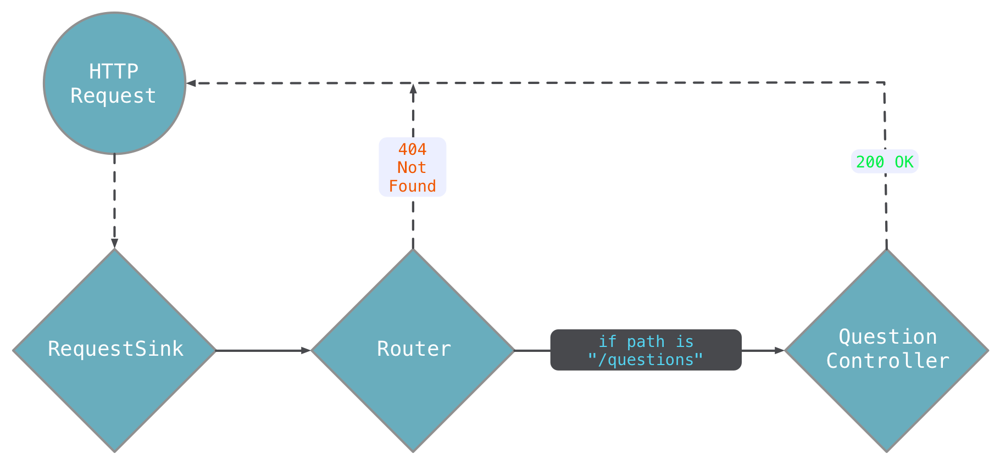

# 1. Getting Started

The purpose of this tutorial series is to become familiar with how Aqueduct works by building an application. To get started, make sure you have the following software installed:

1. Dart ([Install Instructions](https://www.dartlang.org/install))
2. IntelliJ IDEA or any other Jetbrains IDE ([Install Instructions](https://www.jetbrains.com/idea/download/))
3. The IntelliJ IDEA Dart Plugin ([Install Instructions](https://www.jetbrains.com/help/idea/dart-support.html))

If at anytime you get stuck, hop on over to the [Aqueduct Slack channel](http://slackaqueductsignup.herokuapp.com).

Installing Aqueduct
---

`aqueduct` is a command-line utility for all things Aqueduct - including creating a new project. Install `aqueduct` with the following command:

```
pub global activate aqueduct
```

!!! warning ""
    If you get warning text about your `PATH`, make sure to read it before moving on.

Creating a Project
---

Create a new project named `quiz`:

```
aqueduct create quiz
```

This creates a `quiz` project directory. Open this directory with IntelliJ IDEA. In IntelliJ's project view, locate the `lib` directory; this is where your project's code will go. This barebones project has two files - `quiz.dart` and `quiz_sink.dart`.

Open `quiz_sink.dart` and click on the `Enable Dart Support` button that will appear.

This file contains a `RequestSink` subclass. A subclass of this type initializes an application. Declaring exactly one subclass of this type is the only requirement an Aqueduct application must fulfill, and it defines which endpoints the application has by overriding its `setupRouter` method. Once a request sink has finished initialization, it will start receiving requests.

Handling Requests
---

When a `RequestSink` gets a request, it sends it to its `Router`. A router figures out the next object to send the request to based on the request's path. That next object might respond to the request, or it might send it to some other object. This goes on until some object responds to the request.

Each of these objects are `RequestController`s; the type that can receive and respond to requests. An Aqueduct application creates and links together instances of existing `RequestController` subclasses (like `RequestSink` and `Router`) and application-specific subclasses. These instances form a series of step that a request will go through before getting responded to. Each of these requests are instances of `Request`. For every `Request`, a `Response` must be created.

These three types - `Request`, `Response` and `RequestController` - are the most important in Aqueduct.

!!! summary ""
    For more details on these types, see [HTTP Guides](../http/overview.md).

In this tutorial, we'll create a Quiz application. We'll start by writing code that responds to a request with a JSON list of questions. The code that handles this request will be written in `QuestionController` - a class that you will write. Create a new file `lib/controller/question_controller.dart` and add the following code:

```dart
import '../quiz.dart';

class QuestionController extends HTTPController {
  var questions = [
    "How much wood can a woodchuck chuck?",
    "What's the tallest mountain in the world?"
  ];

  @httpGet
  Future<Response> getAllQuestions() async {
    return new Response.ok(questions);
  }
}
```

`HTTPController` - the superclass - is the most often used controller in Aqueduct because it has special behavior that *binds* requests to its methods.

The method `getAllQuestions` - with its `@httpGet` metadata - is bound to HTTP `GET` requests. This method is invoked anytime a `QuestionController` receives a `GET` request. A method with this metadata must return a `Future<Response>` that fulfills the request. These methods are called *responder methods*.

!!! tip ""
    There are `httpPut`, `httpPost`, `httpDelete`, and `HTTPMethod()`, too. They all bind an HTTP method to a responder method.

In this case, a `QuestionController` will return a 200 OK response with a JSON list of question strings for all `GET` requests. For a `QuestionController` to receive requests, we have to add a route to it. In `lib/quiz_sink.dart`, add this import to the top of the file:

```dart
import 'controller/question_controller.dart';
```

And then in `QuizSink`, add a new route in `setupRouter`:

```dart
@override
void setupRouter(Router router) {
  router
    .route("/questions")
    .generate(() => new QuestionController());

  /* This code was added by the template, you may delete it */
  router
    .route("/example")
    .listen((request) async {
      return new Response.ok({"key": "value"});
    });
}
```

This code routes the endpoint `/questions` to an instance of `QuestionController`. We can verify this rather quickly. In the project directory, run:

```
aqueduct serve
```

Then, in a browser, enter `http://localhost:8081/questions`. You'll see the following text:

```
["How much wood can a woodchuck chuck?","What's the tallest mountain in the world?"]
```

Try another route that you didn't add - like `http://localhost:8081/foobar` - and you'll get a 404 Not Found page. If there is no route registered for the request, the `Router` returns a response and no other controllers will receive the request.



The organization of an application's `RequestController`s is called a *request channel*. The channel always starts with `RequestSink` and is then split into sub-channels by `Router.route`. More controllers are then added to these sub-channels.

Here, the sub-channel for requests with path `/questions` starts (and ends) with an instance of `QuestionController`. We know that if a `QuestionController` receives a `GET` request, it will respond with a list of questions. Thus, `GET /questions` returns a list of questions.

Constructing the channel should look familiar to to using higher-ordered functions on `List`s and `Stream`s:

```dart
var adults = people
  .where((p) => p.age >= 18)  
  .toList();
```

With higher-ordered functions, each function takes an input and emits an output. When higher-ordered functions are chained together, their output is used as the input to the next function. This is exactly how Aqueduct's request channel works, except the methods are named things like `route` and `generate`.

!!! tip "Request Channel Methods"
    There are three methods for constructing the request channel: `pipe`, `generate` and `listen`. A `Router` has a special method, `route`. Each has slightly different behavior and are covered in more detail [here](../http/request_controller.md). For now, understand that a new instance of `QuestionController` is created each time a `/questions` request is received.


Routing and Another Route
---

So far, we've added a route that matches the constant string `/questions`. Routes can also have variables and optional segments; this allows us to form groups of routes with a simple syntax. We'll add an optional variable to the end of our existing route so that both `/questions` and `/questions/1` (or 2, or 3, ...) all match this route.

In `quiz_sink.dart`, modify the code in the `QuizSink.setupRouter` by adding "/[:index]" to the route.

```dart
  @override
  void setupRouter(Router router) {
    router
        .route("/questions/[:index]")
        .generate(() => new QuestionController());
  }
```

The square brackets indicate that route segment is optional and the colon indicates that it is a variable named `index`. A variable will match whatever the segment is in the request path and store it so `QuestionController` can use it.

With this optional variable, both `/questions` and `/questions/:index` will be received by `QuestionController`. We need to add a new responder method to `QuestionController` that gets called when a request for a specific question is made:

```dart
class QuestionController extends HTTPController {
  var questions = [
    "How much wood can a woodchuck chuck?",
    "What's the tallest mountain in the world?"
  ];

  @httpGet
  Future<Response> getAllQuestions() async {
    return new Response.ok(questions);
  }

  @httpGet
  Future<Response> getQuestionAtIndex(@HTTPPath("index") int index) async {
    if (index < 0 || index >= questions.length) {
      return new Response.notFound();
    }

    return new Response.ok(questions[index]);  
  }
}
```

Reload the application by hitting Ctrl-C in the terminal that ran `aqueduct serve` and then run `aqueduct serve` again.

In your browser, enter `http://localhost:8081/questions` and you'll get the list of questions.

Then, enter `http://localhost:8081/questions/0` and you'll get the first question. If you enter an index not within the list of questions or something other than an integer, you'll get an error response.

!!! warning "Closing the Application"
    Once you're done running an application, stop it with `^C`. Otherwise, the next time you try and start an application, it will fail because your previous application is already listening for requests on the same port.

When a request matches a route, the value for any path variables is stored in the `Request` object. In the case of `/questions/1`, the path variable `index` has a value of `1`; whereas `index` is null if the path is `/questions`. When the request makes it to the `QuestionController`, it will select which responder method to run based on the HTTP method and the value of any path variables.

The `@HTTPPath` metadata for the argument to `getQuestionAtIndex` is called a *path binding*. When a request for `GET /questions/1` is made, the path variable `index` will be non-null and `getQuestionAtIndex` will be invoked. The argument `index` will be equal to the path variable's value.

!!! tip ""
    The bound argument's name does not have to be the same as the path variable it is bound to.


If the path variable `index` is null (i.e. `GET /questions`), `getAllQuestions` is invoked. A responder method is only selected if both its path and method bindings match the incoming request. If there is no responder method for a request, an appropriate error response is returned.

!!! tip ""
    This 'binding' behavior is specific to `HTTPController`. In addition to path variables, you can bind headers, query parameters and bodies. Check out [HTTPControllers](../http/http_controller.md) for more details.

The More You Know: Multi-threading and Application State
---
In this simple exercise, we used a constant list of question as the source of data for the questions endpoint. For a simple getting-your-feet-wet demo, this is fine.

However, in a real application, it is important that we don't keep any mutable state in a `RequestSink` or any `RequestController`s. This is for three reasons. First, it's just bad practice - web servers should be stateless. They are facilitators between a client and a repository of data, not a repository of data themselves. A repository of data is typically a database.

Second, the way Aqueduct applications are structured makes it intentionally difficult to keep state. For example, `HTTPController` is instantiated each time a new request comes in. Any state they have is discarded after the request is finished processing. This is intentional - you won't run into an issue when scaling to multiple server instances in the future, because the code is already structured to be stateless.

Finally, Aqueduct applications are set up to run on multiple isolates. An isolate is effectively a thread that shares no memory with other threads. If we were to keep track of state in some way, that state would not be reflected across all of the isolates running on this web server. So depending on which isolate grabbed a request, it may have different state than you might expect. Again, Aqueduct forces you into this model on purpose.

Isolates will spread themselves out across CPUs on the host machine. Each isolate will have its own instance of your `RequestSink` subclass. Having multiple isolates running the same stateless web server on one machine allows for faster request handling. Each isolate also maintains its own set of services, like database connections.

## [Next Chapter: Writing Tests](writing-tests.md)
